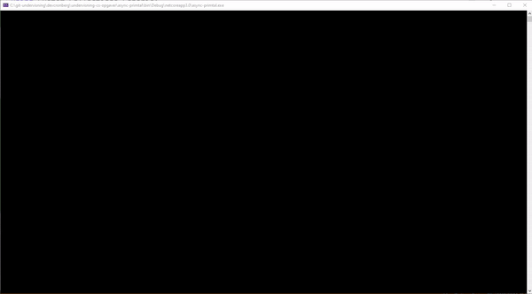

# ASync (primtal)

I denne opgave skal du forstå forskellen på en synkron funktion og en asynkron funktion. 

Start med at skabe en .NET Core konsol applikation, og erstat hele koden med følgende:

```csharp
using System;
using System.Collections.Generic;
using System.Threading.Tasks;

namespace async_primtal
{
    class Program
    {
        static void Main(string[] args)
        {
            Console.WriteLine("Main start");
            Run1(60000);
            for (int i = 0; i < 10; i++)
            {
                System.Threading.Thread.Sleep(500);
                Console.Write(i.ToString("00"+ " "));
            }            
            Console.WriteLine("Main slut");
        }

        static void Run1(int antal)
        {
            Console.WriteLine("Run1 start");
            var res1 = FindPrimtal1(antal);
            Console.WriteLine($"\nAntal fundet: {res1.Count}");
            Console.WriteLine("\nRun1 slut");
        }

        public static List<int> FindPrimtal1(int tilVærdi)
        {
            Console.WriteLine("FindPrimtal1 start");
            List<int> primes = new List<int>();
            bool isPrime = true;
            for (int i = 2; i <= tilVærdi; i++)
            {
                for (int j = 2; j <= tilVærdi; j++)
                {
                    if (i != j && i % j == 0)
                    {
                        isPrime = false;
                        break;
                    }
                }
                if (isPrime)
                {
                    primes.Add(i);
                }
                isPrime = true;
            }
            Console.WriteLine("FindPrimtal1 slut");
            return primes;
        }
    }
}
```

Kør programmet om læg mærke til hvad der sker:

- Først skrives "Main start"
- Så skrives "Run1 start"
- Så skrives "FindPrimtal1 start"
- Så skrives "FindPrimtal1 slut"
- Så skrives "Antal fundet: 6057" (der er 6057 primtal mellem 1 og 60.000)
- Så skrives "Run1 slut"
- Så skrives der en talrække fra 00 til 10 med 500 ms interval
- Så skrives "Main slut"

Følg logikken i koden... Er du med på hvorfor den gør som den gør? Og at alt er synkront? Beviset på at
koden er synkron er, at tal først begynder at skrives **efter** der er fundet primtal.


Tilføj nu disse to funktioner:

```csharp
static async Task Run2(int antal)
{
    Console.WriteLine("Run2 start");
    var res1 = await FindPrimtal2(antal);
    Console.WriteLine($"\nAntal fundet: {res1.Count}");
    Console.WriteLine("\nRun2 slut");
}

public static Task<List<int>> FindPrimtal2(int tilVærdi)
{
    Console.WriteLine("FindPrimtal2 start");
    Task<List<int>> t = new Task<List<int>>(() =>
    {
        List<int> primes = new List<int>();
        bool isPrime = true;
        for (int i = 2; i <= tilVærdi; i++)
        {
            for (int j = 2; j <= tilVærdi; j++)
            {
                if (i != j && i % j == 0)
                {
                    isPrime = false;
                    break;
                }
            }
            if (isPrime)
            {
                primes.Add(i);
            }
            isPrime = true;
        }
        return primes;
    });
    t.Start();
    Console.WriteLine("FindPrimtal2 slut");
    return t;
}
```

og ret main til at kalde Run2(60000) i stedet for Run1(60000):

```csharp
Console.WriteLine("Main start");
Run2(60000);    // Glem evt warning - eller skriv _ = Run2(60000)
for (int i = 0; i < 10; i++)
{
    System.Threading.Thread.Sleep(500);
    Console.Write(i.ToString("00"+ " "));
}
Console.WriteLine("Main slut");
```

Kør programmet, og resultatet skulle gerne blive

- Først skrives "Main start"
- Så skrives "Run2 start"
- Så skrives "FindPrimtal2 start"
- Så skrives "FindPrimtal2 slut"
- Så begynder der at dukke tal op
- Så skrives "Antal fundet: 6057" (der er 6057 primtal mellem 1 og 60.000)
- Så skrives "Run2 slut"
- Og dukker der flere tal op (op til 10)
- Så skrives "Main slut"



Kan du forstå hvad der sker? 

Når FindPrimtal2 kaldes så åbner den en tråd hvor primtal findes, metoden afsluttes, og eksekvering returneres
til Main(). Main() kører videre og begynder at skrive tal. Når svaret fra FindPrimtal2 er tilgængelig i Run2() skrives antal, og 
"Run2 slut". Pointen er, at await i Run2() holder styr på context, afventer svar fra FindPrimtal2 men lader hovedtråden fortsætte med at skrive tal. 

Forstå du ideen bag async og await bedre? 

Se evt. [løsning](https://github.com/devcronberg/undervisning-cs-opgaver/blob/master/async-primtal/Program.cs)

<!-- footerstart -->
> Denne opgave må ikke benyttes uden tilladelse fra Michell Cronberg (michell@cronberg.dk)
<!-- footerslut -->
